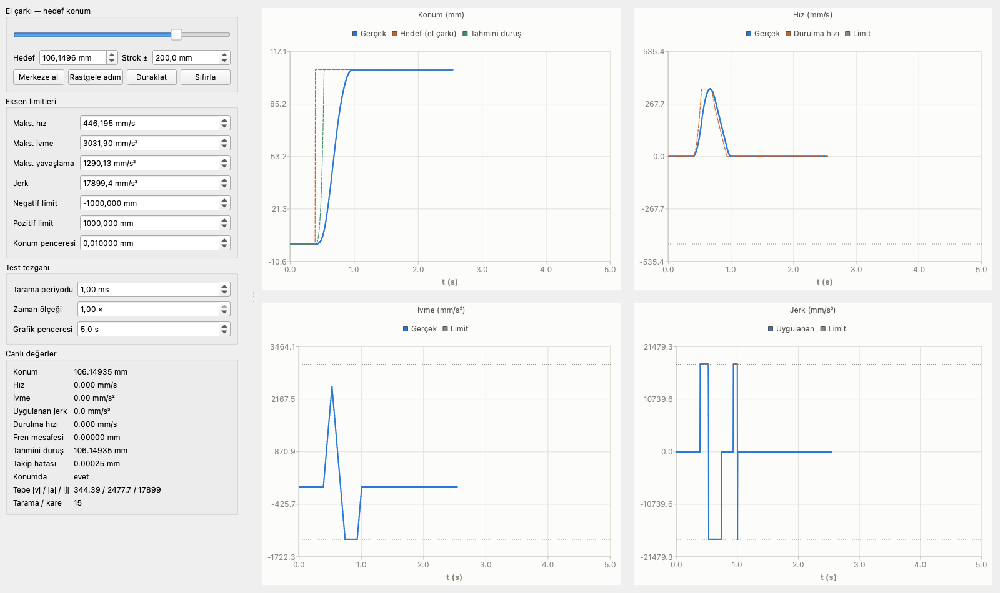

# OnlineTrajectoryGenerator

**A jerk-limited motion core that re-decides the whole trajectory every scan.**

There is no stored profile. Nothing is planned up front, nothing is cached, nothing survives
between calls. Once per cycle the core is handed *where the axis is*, *what it may not exceed* and
*where it is told to go*, and it returns the state one cycle later:

```c
TrajectoryStep GenerateTrajectory(const MotionState *state, const MotionLimits *limits,
                                  const MotionCommand *command, double deltaTime);
```

That is the entire interface. The command may change on any scan — a handwheel, a sensor, a path
planner upstream, an operator changing their mind — and the core simply answers again, inside the
velocity, acceleration, deceleration and jerk limits, every time.

The command is either a **position** to stop on or a **velocity** to hold:

```c
MotionCommand go   = { MOTION_COMMAND_POSITION,  250.0 };   // mm
MotionCommand jog  = { MOTION_COMMAND_VELOCITY,  -80.0 };   // mm/s
GenerateTrajectory(&state, &limits, &go, dt);
```

The second is what an `MC_MoveVelocity` or a jog is built on. There is no target to stop at, so the
software position limits are the only thing that bounds the travel — set them and the axis comes to
rest exactly on the limit, jerk-limited all the way.



**[20-second recording of the rig](docs/rig.mp4)** — random commands with the limits randomised too,
then ten seconds of the handwheel being swung by hand, then random commands again. The axis never
leaves its limits and never stops re-deciding.

## Why scan-based

A point-to-point profiler answers "how do I get from A to B" once, and everything after that is a
lie the moment reality moves. This core answers "what do I do **right now**", so a moving target,
a changed limit, a feed override or an abort are not special cases — they are just the next scan.

The decision is made on the state the axis will be in at the **end** of the scan, not the one it is
in now. That distinction is the whole trick: tested on the current state, every switching point
lands one cycle late, and a jerk-limited axis can never give back what one late cycle costs.

## Where it fits

The core knows nothing about machines. It is kinematics plus limits, so it drops into anything that
moves one axis under dynamic constraints:

- **CNC and machine tools** — feed axes, spindles positioning, tool changers
- **Robotics** — per-joint interpolation under joint velocity/acceleration/jerk limits
- **Mobile robots and AGVs** — longitudinal speed control, docking approaches
- **Gantries, handling, packaging, winders** — anything with a servo and a limit sheet

It is the engine, not the controller. The motion layer on top owns the state machine,
`Done` / `Busy` / `CommandAborted`, buffering, blending and `MC_Stop` priority. Blending needs
nothing extra from the core: hand it a fresh target on any scan — that is what it is built for.
A feed override is simply a scaled `MaxVelocity` passed in.

## What has been verified

Every number below is measured, not estimated.

| Stage | Check | Result |
|---|---|---|
| **Brake distance** | against a 2e-7 s integration of the optimal brake, 2991 random states, every regime and both directions | **0.0000 mm** worst difference |
| **Full moves** | 2000 moves per scan period with **all four limits randomised**, at 1 ms and 0.2 ms | overshoot **0.0000000 mm**, **zero** target crossings |
| **Velocity commands** | 2000 runs per scan period, random start state and command, limits randomised | **2000/2000** land on the command exactly, `\|v - cmd\|` = **0.0e+00**, no wander afterwards, `MaxVelocity` never exceeded |
| **Software limits** | a velocity command driven into a position limit | comes to rest at **100.000000 mm** against a 100 mm limit, worst breach 3.7e-07 mm |
| **Acceleration limits** | same sweep, `max_acc` while speeding up, `max_dec` while slowing down | **never exceeded** |
| **Jerk limit** | same sweep | worst excursion **4.4e-10** |
| **Direction symmetry** | 5000 mirrored move pairs, every sign flipped | `\|forward + backward\|` = **0.000e+00**, bit-identical |
| **Real-time cost** | 200k scans, -O2 | **0.147 µs** per scan, **0.015 %** of a 1 ms cycle |
| **Determinism** | scan path audited | no allocation, no recursion, no unbounded loop — fixed cost every cycle |
| **Limit ordering** | `jerk >= acc/dec >= vel` | enforced inside the core, on its own copies; the caller's parameters are never written |

The rig in the screenshot is the test bench: an absolute handwheel sampled *inside* the scan loop,
four live charts against their limits, an adjustable scan period, and a random button that
randomises the target and all four dynamic limits at once.

## What is not verified yet

Stated plainly, because a motion core that oversells itself is worse than one that does not exist.

- **The signed stop displacement.** The position feasibility test uses a brake distance that carries
  no direction. While the axis runs *away* from the target it reports the distance to standstill the
  other way, so the test can pass right up to the turnaround. 189 of 20000 random *(velocity,
  acceleration)* start states still ring because of it, and it is the same defect behind a residual
  software-limit breach (999 of 1000 moves rest exactly on the limit; the worst breach is 7.8 mm at
  a 1 ms scan and it shrinks with the scan period). One quantity fixes both: the signed displacement
  to reach `v = 0` **and** `a = 0`. This is the next piece of work.
- **Hardware.** Everything above is simulation. No drive, no real scan jitter, no drive that fails
  to follow the jerk command. `deltaTime` is a plain parameter — calling the core on a deterministic
  cycle is the integrator's responsibility.
- **Velocity mode at a zero crossing.** An acceleration that was legally `max_dec` while slowing a
  backward motion becomes an *acceleration* the moment the velocity crosses zero; if `max_acc` is
  smaller it is briefly over it. The core walks it back at the jerk limit — dropping it instantly
  would break jerk — so the excursion is bounded by `max_dec - max_acc` and unavoidable. Some
  reversing velocity commands also pass the command and come back before settling exactly on it.
- **A start state already past the velocity limit** will exceed it on the way down by
  `a0^2 / (2 * jerk)`. Nulling that acceleration costs exactly that much velocity and nothing can
  prevent it; it is physics, not a defect, but a real system needs a policy for it.

## Build

Requires Qt6 (Widgets + Charts), CMake and a C++17 compiler.

```bash
cmake -B build -S .
cmake --build build -j
./build/onlinetest
```

macOS, where Qt comes from a keg-only Homebrew formula:

```bash
brew install qt
cmake -B build -S . -DCMAKE_PREFIX_PATH=/opt/homebrew/opt/qt
cmake --build build -j
```

The core itself is two files — `src/TrajectoryGenerator.h` and `src/TrajectoryGenerator.c` — plain
C99 depending on nothing but `math.h`, so it drops into a controller as it is. The header is
`extern "C"` guarded, so C++ can include it unchanged. Qt is only for the test rig.
